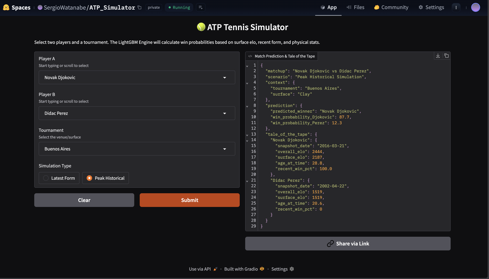
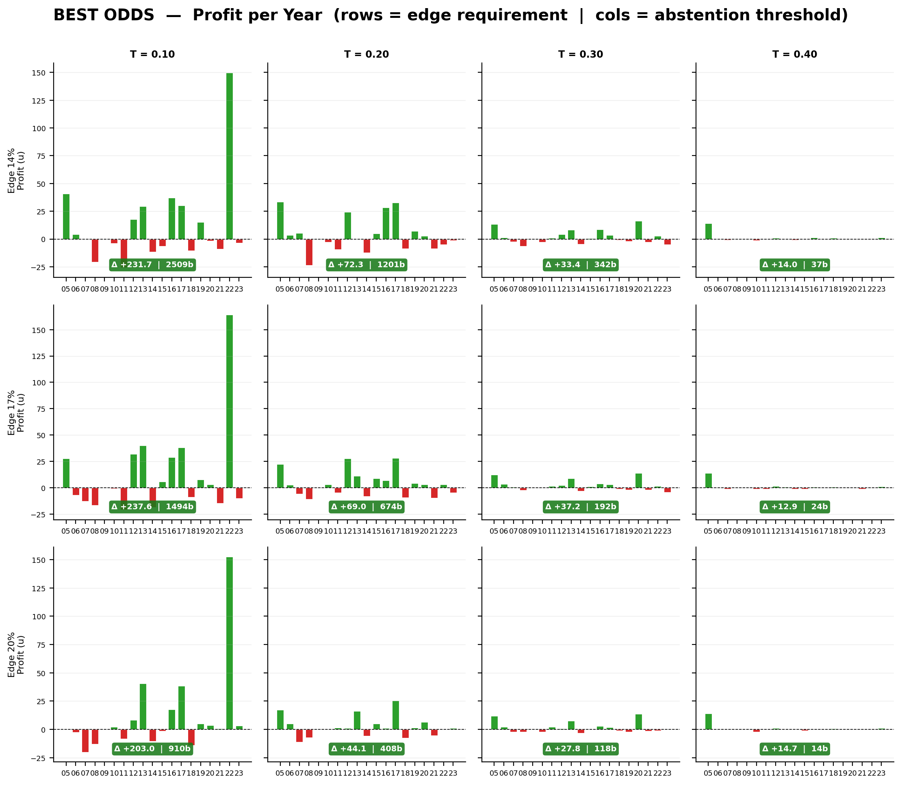
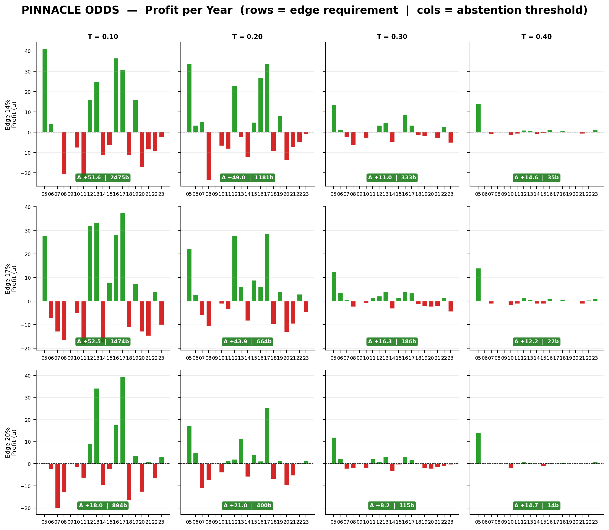
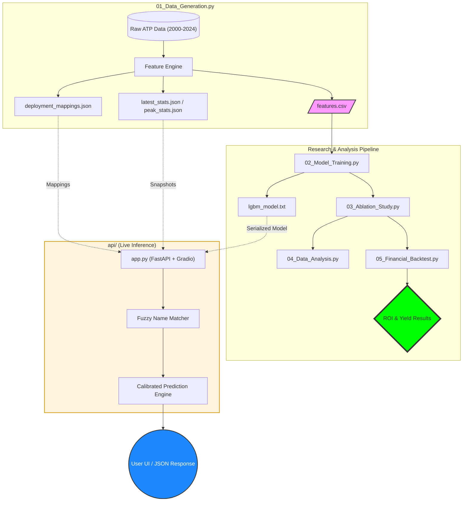
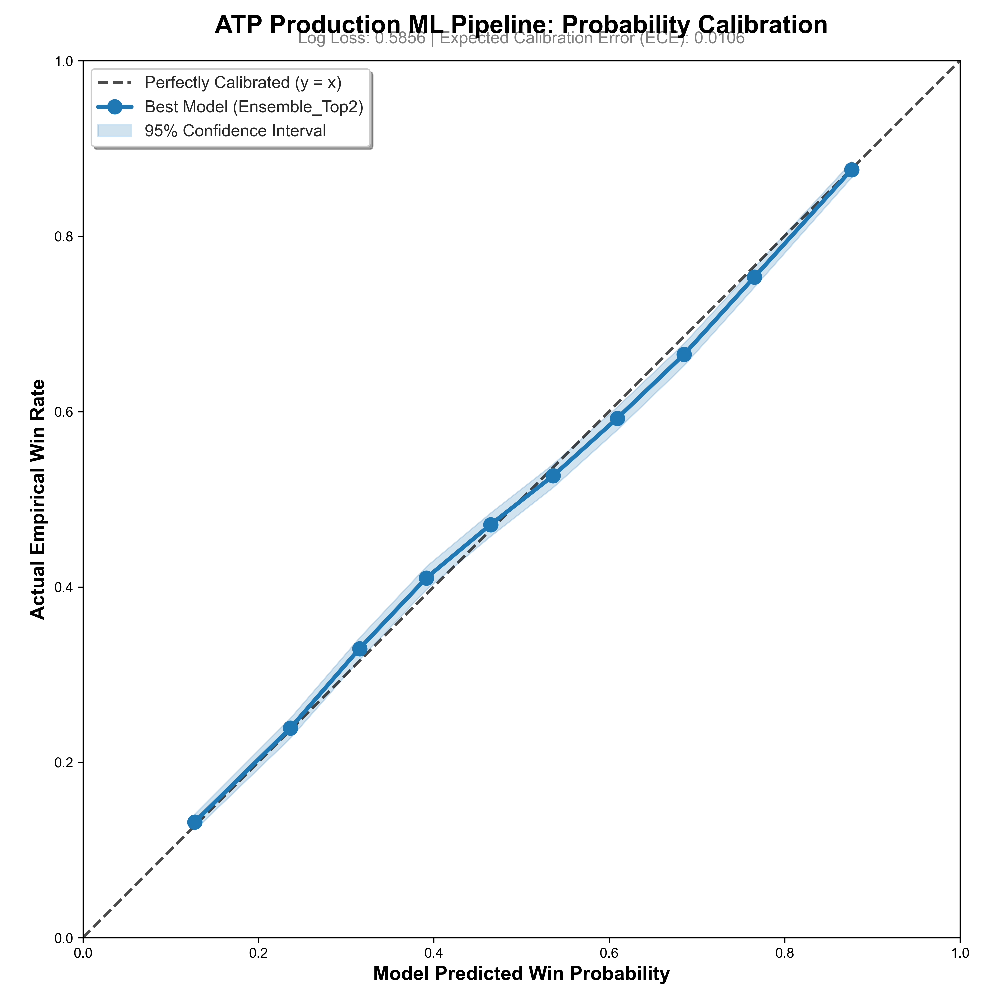
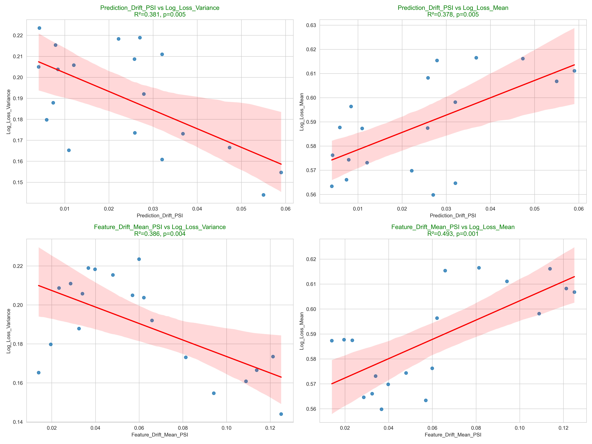

# 🎾 ATP Prediction Engine: Alpha Decay & Market Regime Analysis


TL;DR: An end-to-end ML pipeline predicting ATP match outcomes with 68.3% accuracy, 0.585 Log-Loss, and .96 calibration slope. This project provides an analysis of Alpha Decay in sports markets, demonstrating how predictive edges evolve as "Sharp" markets (Pinnacle) reach hyper-efficiency while "Soft" markets (Market Average) remain exploitable.

### 🔴 LIVE DEMO: [Play with the Inference Engine on Hugging Face](https://huggingface.co/spaces/SergioWatanabe/ATP_Simulator)

<p align="center">
  
</p>


# 📈 Financial Backtest: The 2020 Efficiency Shift

A temporal analysis of the backtest (2015–2024) reveals a significant Regime Shift. As machine learning techniques became democratized circa 2018–2020, "Sharp" market efficiency increased, pricing out standard temporal features.


**1. The Historical Era (2015–2018)**
---
In this regime, the model's features (Fatigue, Surface-Specific Elo, Serve Quality) provided a massive technological advantage over the market consensus.
- Pinnacle (Sharp) Yield: +44.67% (20% Edge / 0.10 Threshold)
- Market Average Yield: +45.46%
Insight: During this era, the market was "slow" to react to player momentum and fatigue, allowing for hyper-normal returns.
<p align="center">
  
</p>

(this simulation bets 1 unit on every match that meets the stated conditions )

**2. The Modern Era (2018–2024)**
---
As professional syndicates adopted similar ML-driven approaches, Pinnacle's closing lines became hyper-efficient.
- Pinnacle (Sharp) Yield: Negative (Market Efficiency Frontier reached).
- Soft Market (Average/Best) Yield: +24.03% to +61.70%.
<p align="center">
  
</p>
(this simulation bets 1 unit on every match that meets the stated conditions )

(this simulation bets 1 unit on every match that meets the stated conditions )


Insight: While "Sharp" alpha has decayed, the system remains a highly effective Value-Finder in "Soft" markets, where bookmaker lines lag behind the theoretical probability.

# 🏗️ System Architecture & MLOps


# 🔬 Core Engineering Features

- Abstention Engine (Risk Management): The system does not bet on every match. It utilizes a dynamic thresholding policy to identify "High-Conviction" mispricings, maximizing Yield per Unit risked.

- 40+ Temporal Features: Moving beyond basic rankings, the model weights Rest Differentials, Long-Layoff Indicators, and Shot Variety Mismatches.

- Selection Bias Awareness: Backtesting was conducted on the 30.3% "Efficient Frontier" (ATP Main Draw). The positive yields found in soft markets represent a conservative baseline for the system's potential in lower-tier, less-efficient markets (Challengers/Qualifiers).

## ⚖️ Statistical Reliability & Risk Mitigation
To ensure the financial returns are driven by mathematical edge rather than variance, the pipeline heavily focuses on probability calibration and risk filtering.

### 1. Perfect Probability Calibration
In algorithmic betting (e.g., using the Kelly Criterion), an accurate probability is more important than raw accuracy. The model achieved a **Calibration Slope of 0.96**, ensuring that when the engine predicts a player has a 70% chance of winning, that cohort historically wins exactly ~70% of the time. 
<p align="center">
  
</p>

### 2. Automated MLOps: Drift Monitoring & Retrain Triggers
Financial and sports models decay over time as the underlying environment evolves. To prevent "silent failures" in production, the pipeline features an automated drift monitoring system.
<p align="center">
  
</p>

📂 Repository Structure

```Text
download
content_copy
expand_less
├── api/
│   ├── app.py                   # FastAPI / Gradio application
│   └── assets/                  # Deployment artifacts (Snapshots & Mappings)
├── src/                         # Modular Logic (The "Engine")
│   ├── feature_eng.py           # Core math for Elo & Fatigue features
│   ├── model_utils.py           # Training & Optuna orchestrators
│   ├── drift_utils.py           # MLOps: PSI & KS monitoring
│   └── inference_utils.py       # Live API feature construction
├── data/                        # Generated CSVs (Features, Predictions)
├── models/                      # Serialized LightGBM models (.txt)
├── Results/                     # 30+ Performance & MLOps dashboards
├── Financial_Backtest_Results/  # ROI & Yield Analysis reports
├── 01_Data_Generation.py        # Pipeline Step 1: Feature Engineering
├── 02_Model_Training.py         # Pipeline Step 2: Training & CV
├── 03_Ablation_Study.py         # Pipeline Step 3: Feature Validation
├── 04_Data_Analysis.py          # Pipeline Step 4: Executive Insights
├── 05_Financial_Backtest.py     # Pipeline Step 5: Real-Odds ROI Analysis
├── requirements.txt
└── README.md
```
# 🛠 Quick Start

**1. Setup**

git clone https://github.com/YourUsername/atp-prediction-pipeline.git
pip install -r requirements.txt

**2. Reproduce Modern Era Backtest**

A. Financial Backtesting (Quick)

Run the backtest using the pre-generated model results in Data/ablation_results_wide.csv:
python 05_Financial_Backtest.py

B. Full Training & Inference (Full)
If you want to retrain the model from scratch and generate new metrics:

python 01_Data_Generation.py

python 02_Model_Training.py

python 03_Ablation_Study.py
#From here you can go directly to 05_Financial_Backtest.py

python 04_Data_Analysis.py

python 05_Financial_Backtest.py 


**3. Launch Inference API**

python api/app.py #open http://0.0.0.0:7860/ in your browser


# 🤝 Strategic Consulting

I specialize in building Regime-Aware machine learning engines. My focus is on identifying Alpha Decay, managing risk through Abstention Policies, and deploying robust MLOps infrastructure.

[🔗LinkedIn](https://www.linkedin.com/in/sergio-watanabe-23ba0a401)

📧 **Inquiries:** [sergiowt452@gmail.com](mailto:sergiowt452@gmail.com)
